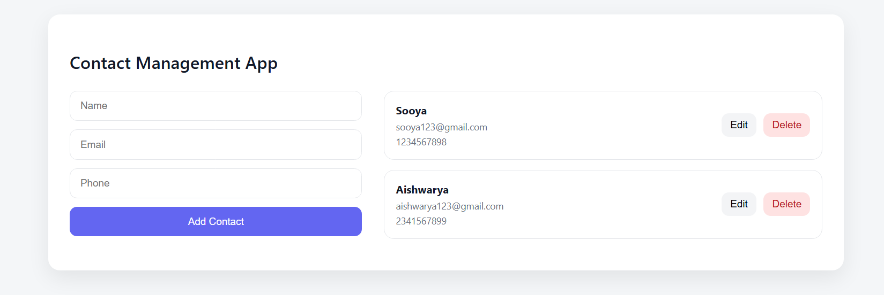

📇 Contact Management Web App (MERN Stack)

A full‑stack Contact Management Application built using the MERN stack (MongoDB, Express, React, Node.js). This project allows users to add, view, edit, and delete contacts with a modern, responsive UI and real‑time feedback.

---

🚀 Features

✅ Add new contacts (Name, Email, Phone)

👀 View contacts (initially shows 4, with View All / Show Less)

✏️ Edit existing contacts

🗑️ Delete contacts with confirmation

🔔 Toast notifications (success / error / info)

📱 Fully responsive (Desktop & Mobile)

🔄 Data persists using MongoDB

---

🛠️ Tech Stack

Frontend

    React.js

    CSS (Responsive layout)

    React Toastify (notifications)

Backend

    Node.js

    Express.js

    MongoDB (Mongoose)

---

📂 Project Structure

contact-manager/
│
├── backend/
|   ├──controllers/
|   |   └──contactController.js
│   ├── models/
│   │   └── Contact.js
│   ├── routes/
│   │   └── contactRoutes.js
│   ├── server.js
│   └── package.json
│
├── frontend/
│   ├── public/
│   ├── src/
│   │   ├── App.js
│   │   ├── App.css
│   │   └── index.js
│   └── package.json
│
└── README.md

---

⚙️ How It Works (Flow)

1. User fills the contact form in the React frontend (port 3000)

2. On submit, a REST API request is sent to the backend (port 5000)

3. Express server processes the request

4. MongoDB stores/retrieves contact data

5. Response sent back to frontend

6. UI updates instantly with toast feedback

---

▶️ How to Run the Project

1️⃣ Start Backend

cd backend
npm install
npm start

Backend runs on:

http://localhost:5000/api/contacts

2️⃣ Start Frontend

cd frontend
npm install
npm start

Frontend runs on:

http://localhost:3000

---

📸 Screenshots (Add These)

Add screenshots here before submission:

Home Page (Desktop)

Add Contact Form

View All Contacts

Mobile Responsive View

Toast Notification Example

Example:

---

🎯 Learning Outcomes

Understanding MERN stack architecture

REST API integration with React

State management using React hooks

Handling async operations & errors

Building responsive UI for real‑world apps

---

🧠 Interview Ready Points

Used client–server architecture

Implemented RESTful APIs

Improved UX with limited list + view‑all toggle

Used toast notifications for user feedback

Designed mobile‑first responsive UI

---

👩‍💻 Author

Aishwarya Kamkar
Built as a full‑stack practice project and internship‑ready submission.

---

⭐ Future Enhancements

Search & filter contacts

Pagination

Authentication (Login / Signup)

Deploy using Render / Vercel

---

✅ This project demonstrates practical full‑stack development using the MERN stack.